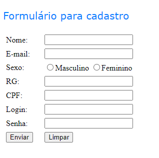

# formulario-simples

Este repositório contém um exemplo de formulário HTML desenvolvido como exercício prático desenvolvido no curso de HTML Avançado da Fundação Bradesco, utilizando exclusivamente a linguagem de marcação HTML.
O formulário pode ser usado para coletar informações do usuário, como nome, e-mail, sexo, RG, CPF, login e senha.

Para usar o formulário, simplesmente copie e cole o código no seu editor de HTML e abra-o em um navegador.
Em seguida, você pode preencher o formulário e clicar no botão "Enviar" para enviar as informações.

Este projeto foi criado como parte do curso de HTML avançado da Fundação Bradesco.

<h3>Como usar:</h3>
<ol>
<li>Copie e cole o código no seu editor de HTML.</li>
<li>Abra o arquivo em um navegador.</li>
<li>Preencha o formulário e clique no botão "Enviar".</li>
</ol>

<h3>Código</h3>
O código do formulário está localizado no arquivo index.html.

<h3>Licença</h3>
Este projeto está licenciado sob a licença MIT.
